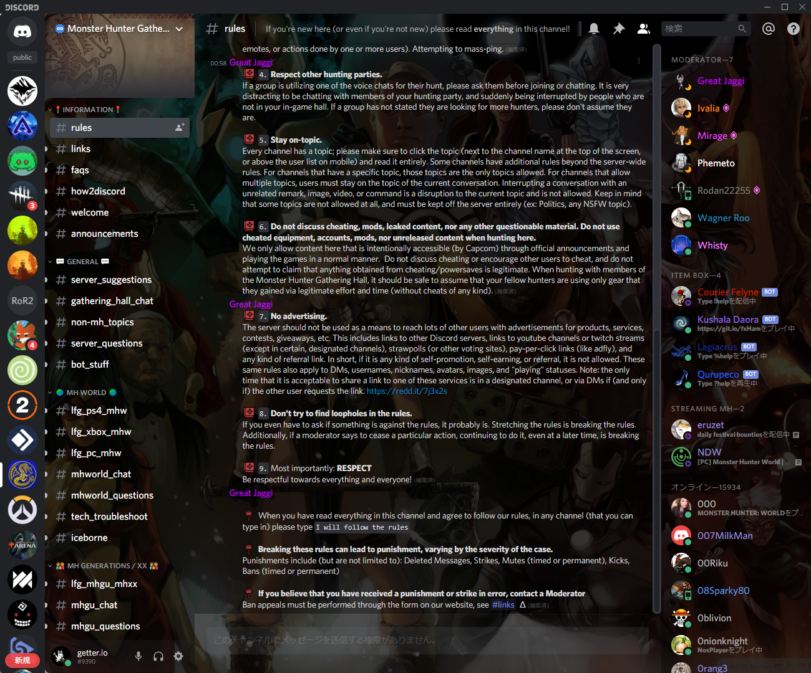

# BetterDiscord用テーマ（CSS）

## 更新履歴
- 2019/10/26 更新
  - 各種スタイルの整理
- 2019/11/10 更新
  - チャンネルの状態ごとのスタイル追加
- 2020/04/22
  - 壁紙変更とセレクタの整理
## メモ
- スタイルシートの名称は`[stylesheet-name].theme.css`とすること
- スタイルシートヘッド部には以下を記述  
```//META{"name":"[stylesheet-name]","description":"describe for THIS [stylesheet-name].","author":"[author]","version":"1.0"}*//```
- 編集時はDiscordのdev tool(`Shift + Ctrl + I`)を用い、ちょこちょこいじる
- Data URIの部分は適宜変更したりする（現在はMarvel All Star）
  - Google Drive から呼び出すように変更